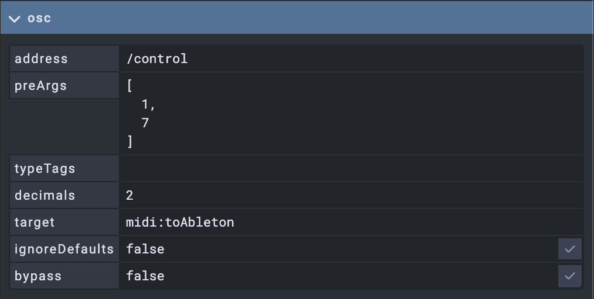

# OPEN STAGE CONTROL HANDBOOK
## https://openstagecontrol.ammd.net

### Configuration :

### Scripting :

###### get the current component value : 
`var increment  = get('this');`

###### set a component value : 
`set('face1',face1Val);`

###### sending OSC Messages : 
`send( '/any/OSC/Adress', value);`  
`send ('127.0.0.1:1239','/test',val);` (specific target)  
`send ('/test',val,42);` (multiple values)  
`send ('/test',{type: 'i', value: 42});` (integer values)  
`send ('/test',{type: 's', value: 'hsllo'})` (string values)  

###### seending multiple OSC Messages 
`for( var i = 0 ; i < 5; i ++)`
`{`
`   send( '/test/'+i, 1);`
`}`

###### get a property : 
`getProp('widgetId','propName')`
`getProp('salle','address')`(return the adress of the widget named 'salle')

###### getting objects as JSON
`var range = getProp('salle','range')`
`console.log('var ' +range.max);`

###### globals variables : 
`console.log('IP '+globals.ip);` 
`console.log('SCREEN '+globals.screen.width);`
`console.log('ORIENTATION '+globals.screen.orientation);`

###### store preset in client (cookies): 
`storage.setItem('myCat', 'Tom');`
`const cat = storage.getItem('myCat');`
`console.log('name '+cat)`

`storage.removeItem('myCat');`
`storage.clear();`

### MIDI 

#### Sending midi 
first, you'll need to create a virtual midiDevice. 
in the home panel, fill the midi field with : `list toAbleton:virtual`.

- 'list' will list the available midi devices.

This will create a midi pipe named 'toAbleton'
Then, in your widget setting, fill the OSC panel like so : 

This will send a CC at midi channel 1 CC 7
Don't forget to change the rangee to 0-127 in cas of a fader

Other possible addresses are : 
- /note
- /note_off
- /program
- /sysex
- /pitch 
- /mtc 

Note that you can send midi messages via the 'onValue' script : 
`send ('/control',1,7,42);`sends a CC to channel 1 CC 7 with value 42

#### receiving midi 

### KEYBOARD 

Only, in 'script' widget. You should define wich key is concerned by the script by filling the key 'keyBinding' field with : 
- 'a' -> script is called when 'a' is pressed 
- 'a + z' -> 'a' and 'z' are pressed 
- ["a", "z"] -> 'a' or 'z' are pressed 
- alt + e -> alt + e combo key
- [''] -> call script if any key is pressed

Then, you can use the result il the 'onKeyboard' script : 
`console.log('key '+type+ ' '+key+' '+ alt);`
`if( key ='a'){`
    `console.log("A is pressed")`
`}`

### CUSTOM  MODULES 