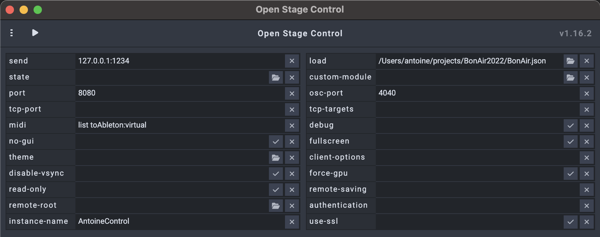
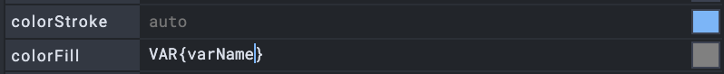
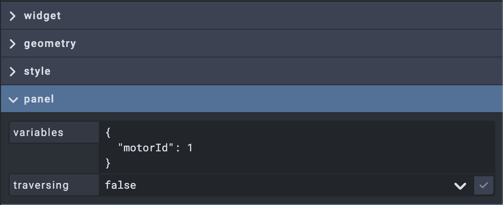
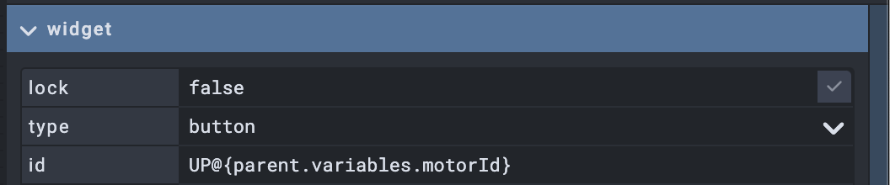
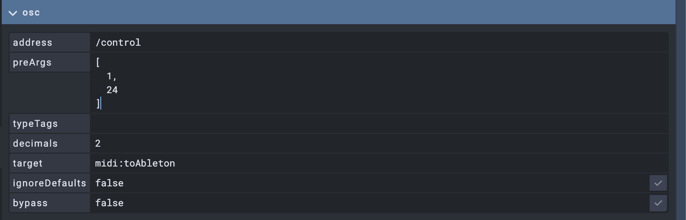

# OPEN STAGE CONTROL HANDBOOK
## https://openstagecontrol.ammd.net

This handbook is a summary and sample of all the usefull commands I personnaly use. 
More detailed configuration available [here](https://openstagecontrol.ammd.net/docs/getting-started/introduction/).
### Configuration :
Here is a default configuration : 

- 'send' is the default OSC target 
- 'port' is the client port (the port used to display the inteerface on your tablet/phone).
- 'instance-name' is the Bonjour discovery name
- 'load' is the current project (note that is no module is loaded, you won't bee able to see the interface on a remote device)
- 'osc-port' is the OSC listening/input port of the application.
### Scripting :

###### get the current component value : 
`var increment  = get('this');`

###### set a component value : 
`set('face1',face1Val);`

###### update a widget property : 
fill the field with a `VAR{varName}`: 

`setVar("widgetId", "varName", "red")`

###### sending OSC Messages : 
`send( '/any/OSC/Adress', value);`  
`send ('127.0.0.1:1239','/test',val);` (specific target)  
`send ('/test',val,42);` (multiple values)  
`send ('/test',{type: 'i', value: 42});` (integer values)  
`send ('/test',{type: 's', value: 'hello'})` (string values)  

###### seending multiple OSC Messages 
`for( var i = 0 ; i < 5; i ++)`  
`{`  
`   send( '/test/'+i, 1);`  
`}`  

###### get a property : 
`getProp('widgetId','propName')`  
`getProp('salle','address')`(return the adress of the widget named 'salle')  

###### getting objects as JSON
`var range = getProp('salle','range')`  
`console.log('var ' +range.max);`  

###### globals variables : 
`console.log('IP '+globals.ip);`  
`console.log('SCREEN '+globals.screen.width);`  
`console.log('ORIENTATION '+globals.screen.orientation);` 

###### store preset in client (cookies): 
`storage.setItem('myCat', 'Tom');`  
`const cat = storage.getItem('myCat');`  
`console.log('name '+cat)`   
  
`storage.removeItem('myCat');`   
cstorage.clear();`   

###### template containers 
If you want to create a module to control an index object (eg a motor) and then duplicate it so it controls another one. 

- create a panel  
- create a variable with an id int he panel properties : 

- refer to that ID for every widget id : 

- access the id from scripts `var widgetName = "widget"+getProp("parent", "variables").motorId`
- duplicating the panel and changing the ID will create another instance to control another motor. 

### MIDI 

#### sending midi 
first, you'll need to create a virtual midiDevice.  
in the home panel, fill the midi field with : `list toAbleton:virtual`.

- 'list' will list the available midi devices.

This will create a midi pipe named 'toAbleton'  
Then, in your widget setting, fill the OSC panel like so :  

This will send a CC at midi channel 1 CC 7  
Don't forget to change the rangee to 0-127 in cas of a fader

Other possible addresses are : 
- /note
- /note_off
- /program
- /sysex
- /pitch 
- /mtc 

Note that you can send midi messages via the 'onValue' script :  
`send ('/control',1,7,42);`sends a CC to channel 1 CC 7 with value 42  
However, you still need to set the target accordingly : `midi:toAbleton` for exemple  

#### receiving midi 

this is an exemple to call the 'onValue' script when receeiving MIDI on Channel 1 CC 24  

You can then use the value like this : 

`var val = get('this'); `  
`console.log(val);`  

Note that you can receive all midi CC by removing the 'preArgs'  
You will then receive arrays [1,24,127] for exemple. 
Getting the MIDI Value is done by the following script :  

`var val = get('this');`  
`console.log(val[2]);`

### KEYBOARD 

Only, in 'script' widget.  
You should define wich key is concerned by the script by filling the key 'keyBinding' field with :  
- 'a' -> script is called when 'a' is pressed 
- 'a + z' -> 'a' and 'z' are pressed 
- ["a", "z"] -> 'a' or 'z' are pressed 
- alt + e -> alt + e combo key
- [''] -> call script if any key is pressed

Then, you can use the result il the 'onKeyboard' script :  
`console.log('key '+type+ ' '+key+' '+ alt);`  
`if( key  === 'a'){`  
    `console.log("A is pressed")`  
`}`  

### CUSTOM  MODULES 
#### using external libraries (with npm)
- create a project with npm init 
- install any library 
- create a 'myModule.js" file 
- import the library with "nativeRequire" instead of "require" -> var artnet = `nativeRequire('artnet')`

