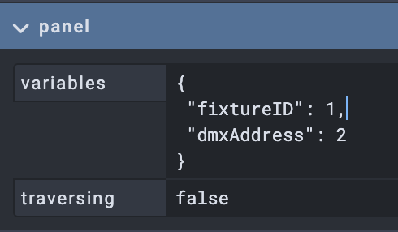
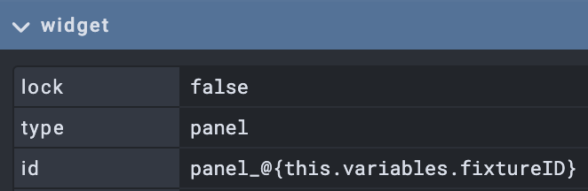
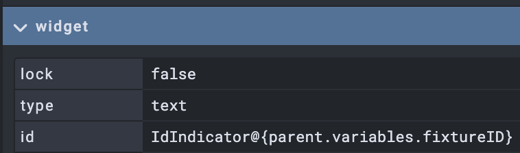
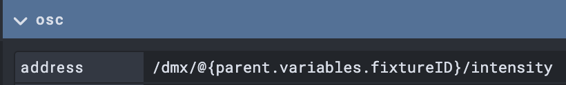

# OPEN STAGE CONTROL HANDBOOK
## https://openstagecontrol.ammd.net

## Using global variables 

This guide will show how to create panels that can easiely be duplicated to be used with different parameters 

Exemple : you want a custom interface to controle a DMX fixture. And you want to be able to duplicate it with a different DMX address 

###### create a panel widget 
This panel will contain all the elements you want to duplicate 
In the variables, add the parameters you want to be specific to each instance : 

###### naming the panel 
Name the panel so it can be easealy duplicated

###### create elements inside the panel 
You can now insert widgets inside the panel. 
And give them ids dynamically : 

Thus when duplicating the panel, all the widget inside will be renamed accordingly  

You can also dynamically generate OSC addresses : 

this will send message OSC with the folowwing address : `/dmx/1/intensity` from our exemple

###### getting variables inside a script : 
`var fixtureID = getProp("parent", "variables").fixtureID`
`var fixtureAddress = getProp("parent", "variables").dmxAddress`

`console.log('fixture loaded '+fixtureID+' DMX :'+fixtureAddress)`